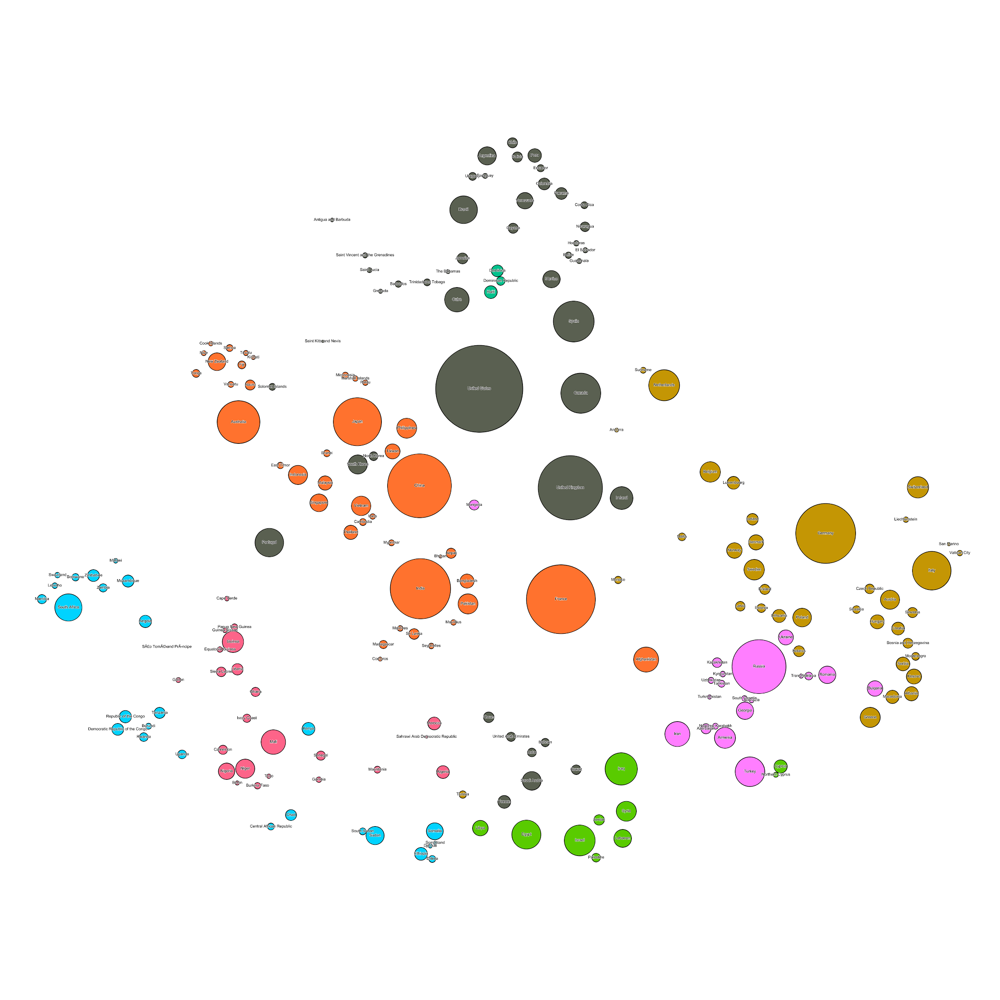

# Scraping Sovereign States on Wikipedia to See Relationships

This is some python code I used to create a neat visualization detailing the relationships countries have to each other.  A relationship between two countries is created when country A's Wikipedia page mentions country B.  The weight of this relationship is the number of mentions on that page. All relationships are directional.

I used the CSV files that this scraper creates to build a data visualization in Gephi.  Here is my final product.

I used a Force Atlas in LinLog mode (creates tighter clusters), and set it to No-Overlap.  The node sizes are determined by In-Degree and the colors of the nodes are determined by their modularity class.

Check out the write-up on my blog [here](http://www.maxwellbuck.com/index.php/2016/11/30/i-clustered-countries-by-wikipedia-references-heres-what-happened/).